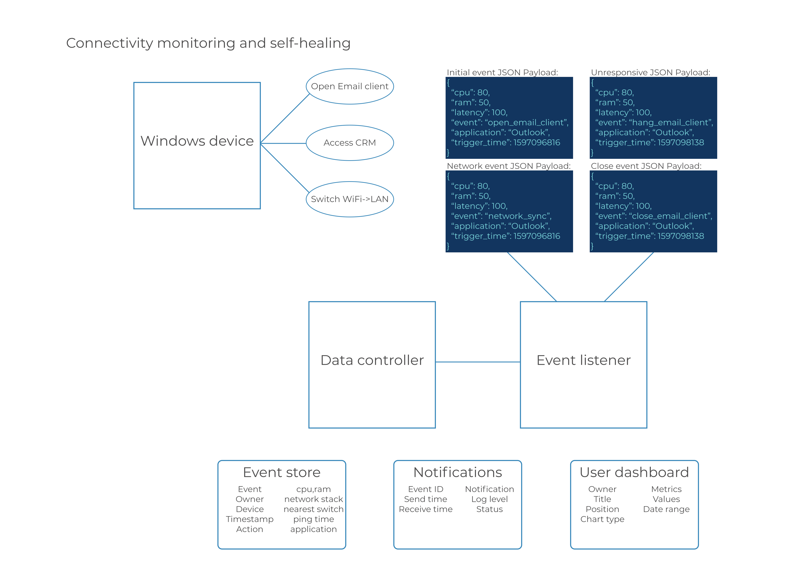

---
# Feel free to add content and custom Front Matter to this file.
# To modify the layout, see https://jekyllrb.com/docs/themes/#overriding-theme-defaults

layout: home
title: Home
nav_order: 0
---

## Project outline

### Data flow diagram

### [Agent specification](agent)

### [Communication protocol](comms_spec)

### [Database structure](db_structure)

### [Example data content](example_data)